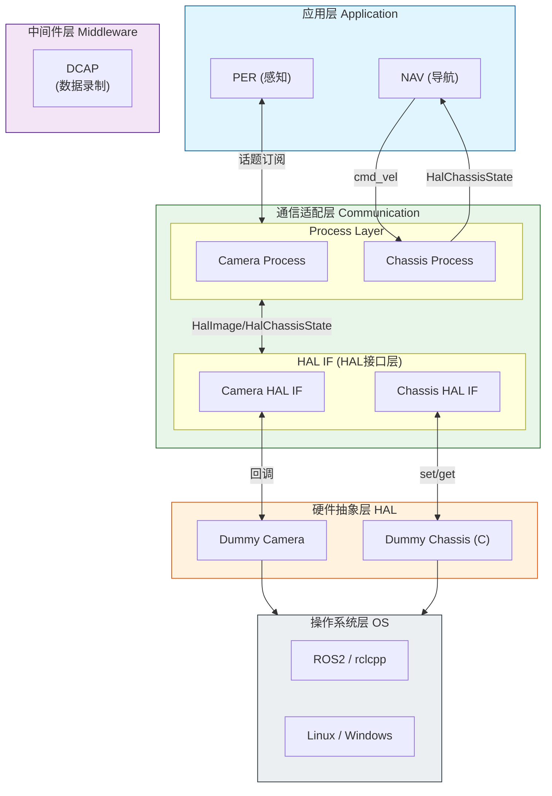

# 服务机器人中间件 Demo (ROS2 / rclcpp)

本demo展示node启动管理，node启动后的inter/intra-process communication，data capture, data replay以及根据回灌数据进行x86上的仿真。

## demo架构

### 分层架构图



### 各层说明

| 层级 | 模块 | 功能 |
| :------ | :-------------- | :--------------------- |
| **APP** | PER | 感知处理（打印接收到的数据） |
| <br /> | NAV | 导航决策（发送cmd_vel，打印数据） |
| **COM** | HAL IF | HAL接口层（get/set操作，转换数据格式） |
| <br /> | Process Layer | 数据转换（convert_to_ros） |
| **HAL** | Dummy Camera | 模拟相机设备（持续输出图像） |
| <br /> | Dummy Chassis | 模拟底盘（C语言实现，存储cmd_vel） |
| **MW** | DCAP | 数据录制（rosbag2_cpp） |
| **OS** | ROS2 / rclcpp | ROS2运行时环境 |
| <br /> | Linux / Windows | 操作系统 |

### 进程说明

| 进程 | 功能 | 线程及功能 |
| :-- | :------------------------------------------------------------- | :------------------------------------------- |
| com_node | 传感器数据转换及传输 | Camera/Chassis 的 HAL IF + Process Thread |
| perception_node | 感知处理 | 打印接收到的图像和IMU数据 |
| navigation_node | 导航决策 | 发送cmd_vel，打印数据 |
| data_recorder_node | 数据录制 | dcap |

### 数据流

| topic | 发送方 | 接收方 | 作用 |
| :------------------------ | :-------------- | :-------------- | :------------ |
| `/camera/front/image_raw` | Camera Process | per | 转换后的ROS图像消息 |
| `/cmd_vel` | nav | Chassis Process | 运动控制指令 |
| `/odom` | Chassis Process | nav | 转换后的ROS里程计消息 |
| `/chassis/hal_state` | Chassis HAL IF | Chassis Process | HAL底盘状态 |
| `/camera/front/hal_image` | Camera HAL IF | Camera Process | HAL图像中间格式 |

### Chassis数据流向

```
nav (发布) --> /cmd_vel --> Chassis Process (订阅) 
    --> HalChassisState (发布) --> Chassis HAL IF (订阅)
        --> C struct cmd_vel --> HAL (存储)
            --> HAL IF get_data --> 打印
```

***

## 编译配置

### 编译命令

```bash
# 正常模式（编译所有模块，包括DCAP）
colcon build

# 仿真模式（X86，仅编译sim相关）
colcon build --cmake-args -DTARGET_SIM=ON
```

### 编译差异

| 组件 | 正常模式 | 仿真模式 (TARGET_SIM) |
| ------------------ | ------- | -------------------------- |
| `dummy_hal` (HAL库) | ✅ 编译并链接 | ❌ 不编译 |
| `com_node` | ✅ 编译 | ❌ 不编译 |
| `perception_node` | ✅ 独立进程 | ❌ 不编译 |
| `navigation_node` | ✅ 独立进程 | ❌ 不编译 |
| `data_recorder_node` (DCAP) | ✅ 编译 | ❌ 不编译 |
| `sim_node` | ❌ 不编译 | ✅ 编译 |
| `data_player_node` (DREP) | ❌ 不编译 | ✅ 编译 |

***

## 运行说明

### 正常模式

```bash
# 启动com_node（包含camera和chassis）
ros2 run service_robot_middleware_demo com_node

# 启动perception_node
ros2 run service_robot_middleware_demo perception_node

# 启动navigation_node
ros2 run service_robot_middleware_demo navigation_node

# 启动data_recorder_node（录制MCAP）
ros2 run service_robot_middleware_demo data_recorder_node
```

### 数据录制

DCAP模块使用rosbag2_cpp录制所有Topic到MCAP文件，用于后续仿真和数据分析。

