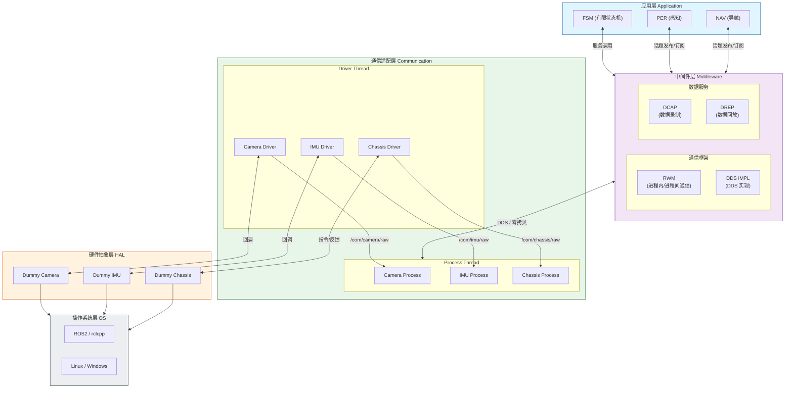
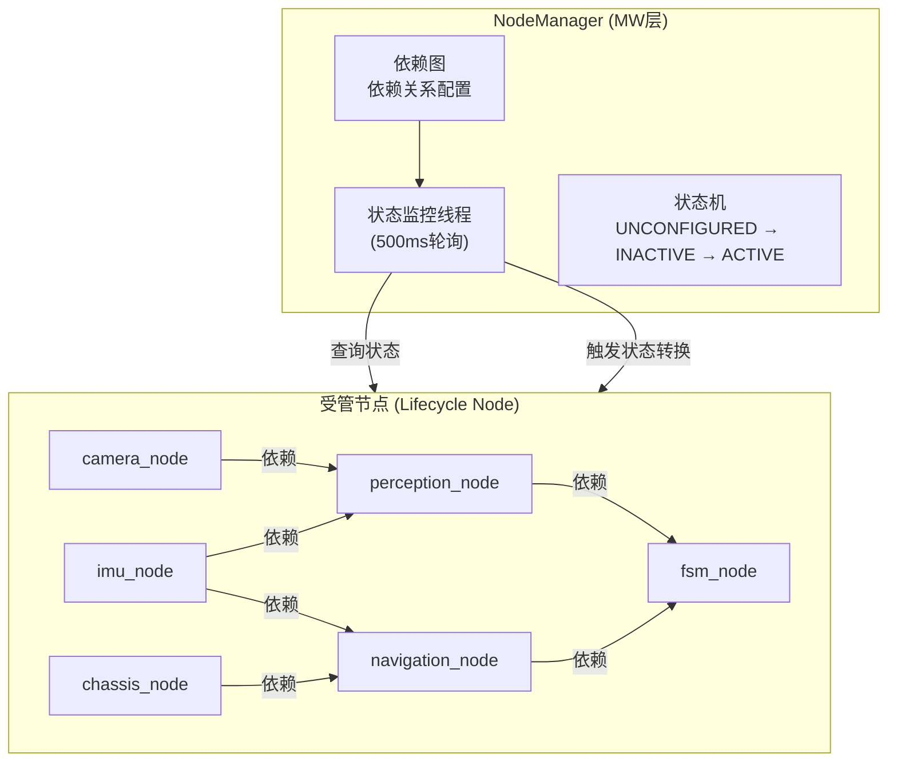
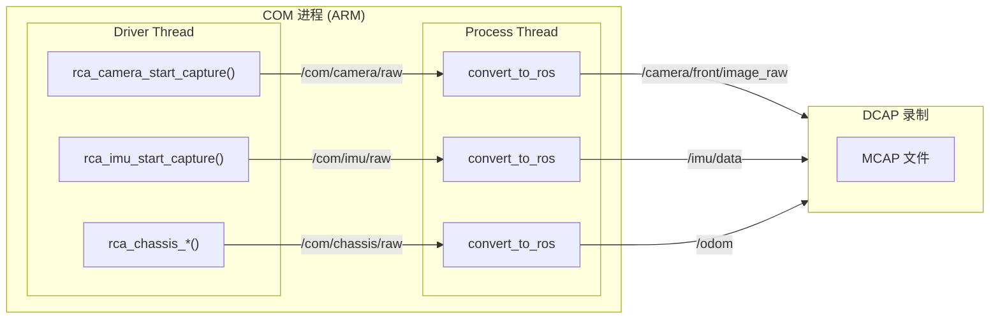
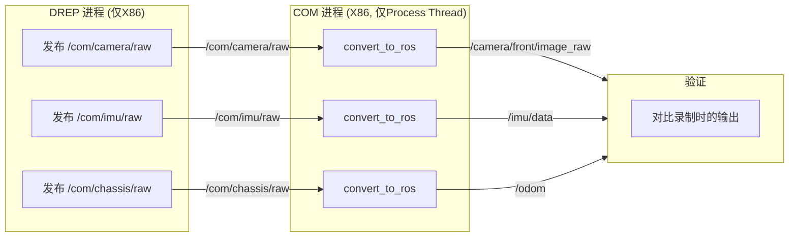

# 服务机器人中间件 Demo (ROS2 / rclcpp)

本demo展示node启动管理，node启动后的inter/intra-process communication，data capture, data replay以及根据回灌数据进行x86上的仿真，包括全node仿真和单独node仿真。

## demo架构

### 分层架构图



### 各层说明

| 层级      | 模块              | 功能                     |
| :------ | :-------------- | :--------------------- |
| **APP** | FSM             | 机器任务状态管理               |
| <br />  | PER             | 感知处理（目标检测、场景理解）        |
| <br />  | NAV             | 导航决策（路径规划、运动控制）        |
| **MW**  | RWM             | 进程内/进程间透明通信（零拷贝）       |
| <br />  | DDS IMPL        | DDS 底层实现（ROS2 默认）      |
| <br />  | DCAP            | 数据录制（rosbag2\_cpp）     |
| <br />  | DREP            | 数据回放（rosbag2\_cpp）     |
| **COM** | Driver Thread   | HAL驱动调用（仅ARM编译）        |
| <br />  | Process Thread  | 数据转换（convert\_to\_ros） |
| **HAL** | Dummy Camera    | 模拟相机设备（持续输出图像）         |
| <br />  | Dummy IMU       | 模拟 IMU 设备（由底盘计算）       |
| <br />  | Dummy Chassis   | 模拟底盘（运动学模型 + IMU 生成）   |
| **OS**  | ROS2 / rclcpp   | ROS2 运行时环境             |
| <br />  | Linux / Windows | 操作系统                   |

### 进程说明

| 进程 | 功能 | 线程及功能 |
| :-- | :------------------------------------------------------------- | :------------------------------------------- |
| com_node | 进行传感器数据的convert及传输 | Camera/IMU/Chassis 的 Driver Thread + Process Thread |
| perception_node | 感知处理 | per |
| navigation_node | 导航决策 | nav |
| data_recorder_node | 数据录制 | dcap |
| node_manager | 节点生命周期管理 | node_manager |
| sim_node (仅SIM) | 全节点仿真（单进程） | 各子节点的线程 |

### 数据流

| topic                     | 发送方             | 接收方             | 作用            |
| :------------------------ | :-------------- | :-------------- | :------------ |
| `/com/camera/raw`         | Camera Driver   | Camera Process  | 中间格式（HAL原始数据） |
| `/com/imu/raw`            | IMU Driver      | IMU Process     | 中间格式（HAL原始数据） |
| `/com/chassis/raw`        | Chassis Driver  | Chassis Process | 中间格式（HAL原始数据） |
| `/camera/front/image_raw` | Camera Process  | per             | 转换后的ROS图像消息   |
| `/imu/data`               | IMU Process     | nav, per        | 转换后的ROS IMU消息 |
| `/odom`                   | Chassis Process | nav             | 转换后的ROS里程计消息  |
| `/cmd_vel`                | nav             | chassis         | 运动控制指令        |

由于hal是dummy的，不会进行真正的nav实时调整闭环逻辑。demo也不必纠结于实时反馈，而是关注

1. 是否能采集所有需要数据
2. 是否能对单个node或多个node的数据进行回放，回灌，仿真。

暂时不需要对于考虑软件内部信号和rclcpp的之间解析的胶水代码，而是per，nav直接使用rclcpp对象

***

## 问题与解决方案

### 问题1：节点生命周期管理与启动顺序

**问题**：各个模块怎么组织成进程，各个子模块怎么组织成线程，各个模块的启动顺序，生命周期管理，保证启动之后再进行模块间通讯等。

**解决方案：NodeManager (MW层)**



**实现要点**：

| 维度       | 方案                                             |
| -------- | ---------------------------------------------- |
| **进程组织** | 每个模块独立进程（executable），或使用 ComponentContainer 组合 |
| **线程组织** | 节点内部使用 rclcpp 多线程执行器（MultiThreadedExecutor）    |
| **启动顺序** | 通过依赖图拓扑排序，按依赖顺序激活节点                            |
| **就绪保证** | 使用 ROS2 Lifecycle Node，节点状态为 ACTIVE 才开始发布/订阅   |
| **管理节点** | `node_manager` 统一监控、调度所有节点                     |

**启动流程**：

```
1. NodeManager 启动
2. 等待所有节点上线（UNCONFIGURED）
3. 按依赖顺序 CONFIGURE 各节点
4. 按依赖顺序 ACTIVATE 各节点
5. 所有节点 ACTIVE → System Ready
```

**代码位置**：`middleware/node_manager/`

***

### 问题2：HAL数据采集与COM层仿真

**问题**：COM层从HAL拿的是自定义C++类型，需要convert\_to\_ros。HAL数据无法直接进入DCAP，因此没法仿真COM层。

**解决方案：COM层内部分层 + 编译宏控制**

#### ARM 编译模式（完整编译）



#### X86 编译模式（仿真模式）



#### 编译宏控制

```bash
# ARM 编译（默认）
colcon build --cmake-args

# X86 编译（仿真模式）
colcon build --cmake-args -DTARGET_SIM=ON
```

#### 编译差异

| 组件 | 正常模式 | 仿真模式 (TARGET_SIM) |
| ------------------ | ------- | -------------------------- |
| `dummy_hal` (HAL库) | ✅ 编译并链接 | ❌ 不编译 |
| `com_node` (多节点进程) | ✅ 编译 | ❌ 不编译 |
| `sim_node` (单进程仿真) | ❌ 不编译 | ✅ 编译 |
| `Driver Thread` | ✅ 编译 | ❌ 被 `#ifndef TARGET_SIM` 屏蔽 |
| `Process Thread` | ✅ 编译 | ✅ 编译（等待 DREP 数据） |
| `perception_node` | ✅ 独立进程 | ✅ 在 sim_node 内 |
| `navigation_node` | ✅ 独立进程 | ✅ 在 sim_node 内 |
| `data_recorder_node` (DCAP) | ✅ 编译 | ❌ 不编译 |
| `data_player_node` (DREP) | ✅ 编译 | ✅ 编译 |
| `node_manager` | ✅ 编译 | ❌ 不编译 |

#### 回放仿真流程

```
1. DCAP (ARM) 录制所有 Topic（包括中间格式）
2. 将 MCAP 文件复制到 X86 环境
3. DREP (X86) 加载 MCAP，按时间戳发布中间格式 Topic
4. COM 节点 (X86) 的 Process Thread 订阅中间格式 Topic
5. Process Thread 执行 convert_to_ros，输出标准 ROS Topic
6. 对比输出与录制时的标准 ROS Topic → 验证 convert 逻辑
```

#### 代码位置

| 文件                             | 说明                                    |
| ------------------------------ | ------------------------------------- |
| `com/camera/camera_node.cpp`   | CameraNode (含 Driver/Process Thread)  |
| `com/imu/imu_node.cpp`         | ImuNode (含 Driver/Process Thread)     |
| `com/chassis/chassis_node.cpp` | ChassisNode (含 Driver/Process Thread) |
| `msg/HalImage.msg`             | HAL 图像中间格式                            |
| `msg/HalImu.msg`               | HAL IMU 中间格式                          |
| `msg/HalChassisState.msg`      | HAL 底盘状态中间格式                          |
| `CMakeLists.txt`               | ARM/X86 编译宏配置                         |

